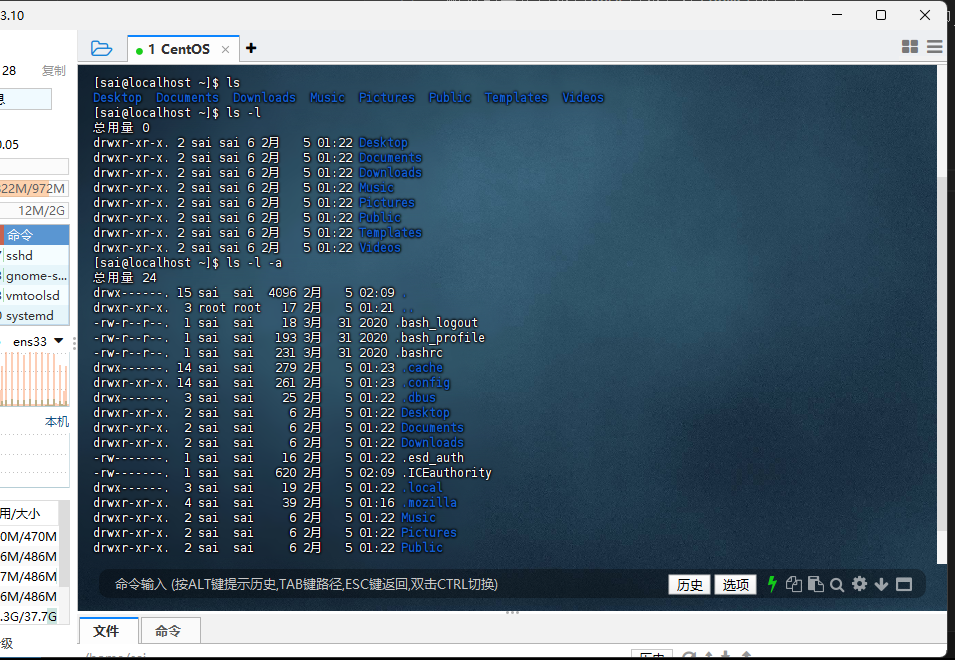

# Linux
## Linux命令
### 什么是命令and命令行
命令行：即Linux**操作终端**
命令：Linux程序
### 通用格式
command//命令 [-opthions]//选项 [parameter]//参数
实例：ls -l /home/sai (ls是命令本身，-l是选项 ，/home/sai是参数)
### ls命令入门
ls作用是列出目录下的内容
**语法细节为：ls [-a -l -h] [路径]**
当不使用选项时，以平铺形式展示当前工作目录的所有文件

默认的工作目录为HOME目录，即/home/用户名
#### [-a]表示列出全部文件，包括隐藏文件（在Linux中前缀为.的即为隐藏文件）

#### -l 表示以列表形式展示，并展示更多信息

选项可以组合使用：

#### -h  表示以易于阅读的形式列出文件的大小，如K，M，G

**-h一定要与-l一起使用，单独使用无效果**
### cd切换工作目录
cd==change dictionary
语法：cd [路径]
**当cd无参数直接使用时表示回到HOME**

### pwd命令 无参数
pwd==print work dictionary
打印当前工作目录

### 相对路径与绝对路径
在HOME时要切换到Desktop目录中时可以写为：
cd /home/sai/Desktop
cd Desktop
绝对路径：以根目录为起点，写完所有路径
相对路径：以当前工作目录为起点，切换到子文件夹中

### 特殊路径符
#### . 表示当前目录
如：cd ./Desktop表示切换到当前目录下的Desktop
#### .. 表示上一级目录
如 cd ..表示切换到上一级目录 cd ../..表示切换到上两级目录
#### ~ 表示HOME目录
如 cd ~ == cd
### mkdir命令
mkdir==make directionary
参数必填，表示要创建的目录的路径，绝对路径与相对路径都可以
[-p]表示自动创建不存在的父目录
### touch命令
touch创建文件
语法：touch 路径

在Linux系统中以颜色区分文件夹，且在以-l显示时，文件夹最前面时D开头

### cat命令 查看文件内容
语法：cat 路径

### more 支持翻页查看文件内容
语法：more 路径
空格翻页，q退出查看
### cp 复制文件文件夹
语法 cp [-r] 参数1 参数2
-r可选，用于复制文件夹，表示递归
参数一：要复制的
参数二：复制到的

### mv移动文件文件夹
语法：mv 参数一 参数二
参数一：要移动的文件文件夹路径
参数二：要移动到的路径

### rm 删除
rm == remove
语法： rm [-r -f] 参数1 参数 2 。。。。。
-r 同cp用于删除文件夹
-f 表示强制删除
每一个参数都表示要删除的文件或文件夹的路径

### 通配符

rm命令支持通配符

### which 查看命令程序文件存放位置
语法：which 要查找的命令

### find 按文件名查找文件
语法：find 起始路径 -name “被查找的文件名”
可以切换到root用户演示：su root

**find命令也可以使用通配符**

### find命令按照文件大小查找文件
语法：find 起始路径 -size +- n [K M G]
(+ -)表示大于小于

### grep命令 过滤文件内容 通过关键字过滤文件行
语法： grep [-n] 关键字 文件路径
-n：可选，表显示匹配行的行号
关键字：要过滤的关键字
文件路径：表示要过滤的文件的路径

### wc命令统计文件的行数。单词数量等
语法： wc [-c -m -l -w ] 文件路径
-c：统计bytes
-m：统计字符
-l：统计行数
-w：统计单词数量
文件路径：被统计的文件
当不使用选项时，显示行数，单词数，字节数
### 管道符 | 将管道符左边命令的结果作为右边命令的输入

文件路径参数不写时可以使用|作为内容输入

**管道符可以嵌套**
### echo命令 在命令行输出指定内容
语法： echo 输出内容

### 反引号 ``
``包裹的内容将作为命令去执行
### 重定向符 >和>>
 “>”：表示将左侧命令的结果覆盖写入到右侧指定的文件中
 “>>”：表示将左侧命令的结果追加写入到右侧指定的文件中
 
 
### tail 查看文件尾部内容，跟踪文件最新更改
语法：tail [-f -num] linux路径
-f 表示持续追踪
-num 表示查看尾部多少行，不填默认十行

ctrl+c停止tail持续追踪
### vim编辑器visual interface Linux中最经典的文本编辑器

**三种模式**
如需编辑文件，语法：vim 文件路径
**若文件不存在则自动创建**
从命令模式输入i进入输入模式
按esc退回命令模式
按下：进入底线命令模式

### root用户
root用户（超级管理员）
拥有**最大系统操作权限**
eg：普通用户无法在根目录下创建文件夹root用户可以
普通用户的权限在HOME不受限
### su命令
su=swich user
语法：su [-] 用户名
-：表示是否在切换用户后加载环境变量
**切换用户后可以通过exit切换回上一个用户，也可以使用快捷键ctrl+d**
### 用户组管理
**用户组创建** **groupadd**
**用户组删除** **groupdel**
1. 创建用户
   useradd [-g -d] 用户名
   -g指定用户的组，如果不指定，会创建同名组并自动加入
   -d指定用户HOME路径，不指定，HOME目录默认在：/home/用户名
2. 删除用户
   userdel [-r ]用户名
   -r：删除用户的HOME目录，不使用则保留HOME目录
   
   
   
