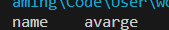
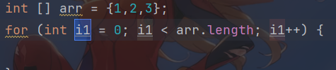

# CMD
盘符+ ：切换到某盘
dir：展示全部文件夹，文件
cd：进入
cd..:回到前一个目录
cls：清屏
exit：退出cmd
## 利用cmd打开QQ
首先切盘，进入bin文件夹，直接输入文件名则打开
**当直接输入qq.exe时找不到此文件，只需要将qq.exe添加到环境变量中，就可以在任意情况下打开qq.exe**
# java基础学习
**先广度后深度**
1. 基础语法
2. 面向对象
3. Api

# JAVA作用
分类：Java SE 为其他两个版本基础，JavaME 开发嵌入式系统，或小型移动设备，Java EE用于web网站开发
作用：桌面应用开发，漏洞少，健壮性好
服务器开发
移动应用开发
matlab
大数据开发hadhoop
游戏开发
## java跨平台原理
高级语言：编程，编译，运行
编译型：先生产obj，再生成不同的代码
解释型：按行翻译，比如python
混合型：先生成.class字节码文件，按行运行在虚拟机上
所以跨平台原理就是虚拟机

# JRE和JDK
JVM：Java虚拟机
核心类库：实现定义的函数
javac：编译工具
Java运行工具
jbd调试工具
jhat
**JDKjava开发工具包：包含JVM，核心类库，开发工具**
**JRE：java的运行环境**
# 注释与关键字
```java
//
/**/
/** */
```
关键字：含有特殊含义的英文单词
关键字全部小写
**class：用于创建类，一个类是java最基本的组成单元：表示定义一个类。**
**class 类名+{}**
# 字面量
**告诉程序员数据在程序中的书写形式**
**字面量类型：**
1. 小数
2. 整数
3. 字符串
4. 字符
5. 布尔
6. 空
细节：NULL不能直接打印，只能以字符串打印
## 特殊字面量：
\t 制表符：表示把前面的字符串的长度补全到8
```java
public class demo1 {
    public static void main(String[] args) {
        System.out.println("name" + '\t'+"avarge");
    }
}
```

# 变量
**在程序运行过程中数据可能变化的值**
**变量定义形式：数据类型 变量名 =数据值**
**数据类型：整数 int 小数 double**
```java
public class demo1 {
    public static void main(String[] args) {
        int x = 3;
        System.out.println(x);
    }
}
```
# 数据类型 标识符 键盘录入
数据类型：基本数据类型，引用数据类型
**基本数据类型：**
1. 整数 ：byte -128~127
          short 
          int
          long
2. 浮点数：float
           double
3. 字符：char
4. 布尔：boolean
5. 字符串：string
注意：long数据后面需要加上L
flaot需要在数据后面加上F
## 标识符
**就是给类，方法，变量的名字**
起名规则：
硬性要求：由数字，字母，下划线，美元符组成
不能由数字开头
不能是关键字
区分大小写
软性要求：
小驼峰命名法：
是一个单词的时候全部小写
由多个单词组成时除了第一个单词首字母小写，其他单词首字母大写
**都要遵守见名知意**
## 键盘录入
java有一个类scanner，可以接受键盘的数字
步骤：
1. 导包 import java.util.Scanner
2. 创建对象Scanner sc = new Scnner(System.in)
3. 接收数据int i = sc.nextInt()
```java
import java.util.Scanner;
public class demo1 {
    public static void main(String[] args) {
        Scanner sc = new Scanner(System.in);
        int i = sc.nextInt();
        System.out.println(i);
    }
}
```
**练习：将三位数拆分**
```java
import java.util.Scanner;

public class Demo1 {
    public static void main(String[] args) {
        Scanner sc = new  Scanner(System.in);
        int input = sc.nextInt();
        int outPut1=input/100;
        int outPut2=(input-outPut1*100)/10;
        int outPut3=(input-outPut1*100-outPut2*10);
        System.out.println(outPut1);
        System.out.println(outPut2);
        System.out.println(outPut3);
    }
}

```
# 运算符
## 字符串预算符
**字符串的+操作，当+操作中出现字符串时，这个+就是字符串连接符了，当连续+时从左到右逐个进行**
3.7+“abc”//“3.7abc”
3.7+2.3+“abc”//“10.0abc”
## 三元运算符
？
关系表达式？表达式1：表达式2；
# 判断和循环
## 分支
if语句 if( 关系式){ 执行语句}
# 数组
静态初始化格式：类型 [] 变量名={1，2，3，4}
自动快速生成数组历遍的方式：数组名.fori

动态初始化格式：类型 [] 变量名 = new int [x];
会自动给出默认的初始化值；布尔默认为false，其余为0，0.00
# 方法
## 定义
**方法是程序中最小的执行单元**
**方法类似于c语言中的函数**
## 格式
方法定义格式：public static void 方法名(){
    方法体
}
## 方法的重载
这些同名的，具有相同功能，具有不同参数类型或参数个数的方法叫做重载的方法。
**同一类中，方法名相同，参数值相同。与返回值无关**
**相同的方法名，通过调用时，参数类型和个数来判断重载方法中的哪一个**
## 基本数据类型和引用数据类型
**在堆中的都是引用数据类型（通过在栈中存储地址值）**
forexample：数组，变量地址值在栈中，其真实值在堆中，则数组是引用数据类型
# 面向对象
## 设计对象并使用
### 类和对象
类：是对对象共同特征的描述
对象：具体事物
public class 类名{
    1. 成员变量
    2. 成员方法
    3. 构造器
    4. 代码块
    5. 内部类
}
得到对象：类名 对象名 = new 类名（）
对象.成员变量
对象.成员方法
**用来描述一类事物的叫做javabean类不用写main方法，编写了main方法的叫做测试类**
类名首字母建议大写
一个Java文件中可以定义多个class，且只能有一个用public修饰
## 封装
**如何正确设计对象和方法**
**对象代表什么，就得封装对应的数据，并提供对应的行为**
ps：人画圆，画的动作需要半径和坐标，故画的动作划归在圆类中
## this关键字
当变量名相同时，调用按照就近原则；
使用this.变量名，表示成员位置的变量，这样就可以在方法中使用与类成员相同名称的变量了
**this实质上表示方法调用者的地址**
## 构造方法
构造方法又叫构造器，用于在创建对象时给成员变量初始化（赋值）
格式：修饰符 类名（参数）{
    方法体；
}
如果不写任何构造方法，虚拟机会自动添加一个空参构造方法
```java
 public girl(int age,String name){
        this.age=age;
        this.name=name;
    }
 girl mygirl= new girl(20,"花花");
```
**无论是否使用，都手动书写无参构造和带全部参数的构造**
**构造方法也可以重载**
## 标准JavaBean类
成员变量全部私有化
提供每一个成员的get成员（）and set成员（）
至少写两个构造方法
alt+insert打开快捷方式快速生成javabean
插件ptg
## 对象内存图
**栈，堆，方法区**
new一个新对象时，在堆中开辟一个空间，并将地址值赋给对象名
默认初始化：NULL and 0 and /u000
显示初始化：在构造类时初始化的
#  字符串
